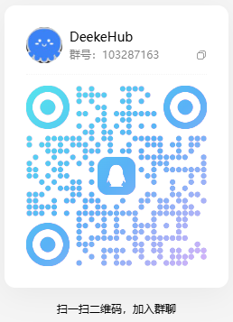

# DeekeHub —— Android自动化平台

> 基于 DeekeScript 自动化引擎打造的 Android自动化管理平台，帮助开发者和企业统一管理 Android设备、自动化脚本和任务。

产品体验：

https://hub.deeke.cn


---

# 项目简介

DeekeHub 是一个 Android自动化平台。

它不仅可以运行 Android自动化脚本，还提供设备管理、自动化任务调度、脚本管理、远程查看、日志监控等能力。

不同于普通的自动化工具，DeekeHub 建立在多年 Android自动化技术积累之上。


在 DeekeHub 之前，我们已经持续维护：

- DeekeScript Android自动化引擎
- Deeke 自动化应用体系
- 多年的 Android群控和自动化项目方案


这些底层能力最终沉淀成为 DeekeHub。

通过 DeekeHub，开发者可以：

- 管理大量 Android设备
- 批量执行自动化任务
- 管理自动化脚本
- 远程查看设备状态
- 构建自己的 Android自动化服务


---

# 为什么选择 DeekeHub？

## 成熟的 Android自动化技术底座

Android自动化涉及大量底层能力：

- AccessibilityService
- OCR
- 图像识别
- 自动点击
- 手势控制
- 网络通信
- 脚本执行
- 任务调度


这些能力在 DeekeScript 中已经进行了长期封装和优化。

开发者无需重复研究 Android底层，只需要关注自动化业务逻辑。


技术链路：

```
JavaScript

    ↓

DeekeScript Runtime

    ↓

Android系统能力

    ↓

Accessibility
OCR
图像识别
HTTP
WebSocket
自动化任务
```


---

# 多年 Android自动化经验沉淀

DeekeHub 并不是一个简单的设备管理后台。

它来源于真实的 Android自动化项目实践。


过去几年，我们积累了大量：

- Android自动化方案
- 手机群控方案
- 批量设备管理经验
- 自动化运营流程


这些经验最终沉淀为平台能力。


从单个脚本运行，到几十台、几百台甚至更多设备统一管理。

DeekeHub 解决的是规模化之后的管理问题。


---

# 基于移动网络的设备通信

传统 Android自动化管理方式通常依赖：

- USB
- ADB
- 局域网
- 固定 IP


这类方式在设备数量增加后，会受到网络环境限制。


DeekeHub 采用设备主动连接模式。

Android设备联网后即可接入平台。


优势：

- 不需要 USB
- 不需要 ADB
- 不需要公网 IP
- 不需要端口映射
- 支持异地设备管理
- 支持大规模设备部署


无论设备位于办公室、机房，还是不同城市，都可以统一管理。


同时，DeekeHub 也支持局域网通信方式，满足企业内部私有化部署需求。


---

# DeekeHub 能解决什么问题？

当 Android自动化规模扩大后，真正困难的不是编写脚本，而是：

- 如何管理大量设备？
- 如何批量执行任务？
- 如何发布脚本更新？
- 如何查看运行状态？
- 如何定位执行问题？
- 如何多人协作？


DeekeHub 将：

- 设备
- 脚本
- 任务
- 日志
- 权限

统一管理。


让 Android自动化从单机工具升级为完整的平台。

---

# 核心功能


## Android设备管理

统一管理大量 Android设备。

支持：

- 设备在线状态
- 设备信息查看
- 分组管理
- 标签管理
- 批量操作
- 设备搜索


无需 USB 和 ADB。

设备联网即可接入平台。


适用于：

- Android设备集群管理
- 手机群控系统
- 云手机管理
- 企业自动化场景


---

## 自动化脚本管理

DeekeHub 基于 DeekeScript 自动化引擎。

开发者可以使用 JavaScript 编写 Android自动化脚本。


支持：

- 脚本上传
- 脚本版本管理
- 脚本发布
- 批量部署
- 脚本运行状态查看


不需要重复在每台设备上手动更新脚本。


---

## Android自动化任务管理

支持创建和管理自动化任务。


例如：

- 批量启动任务
- 批量停止任务
- 定时执行任务
- 多设备同时运行
- 自动化流程控制


适用于需要大量设备同时执行任务的场景。


---

## 远程查看 Android设备

支持实时查看 Android手机画面。


应用于：

- 自动化调试
- 远程维护
- 设备巡检
- 客户演示


采用低带宽实时传输方式。

适合大量 Android设备远程管理。


---

## 日志与运行监控

记录自动化任务完整运行过程。


包括：

- 任务执行日志
- 错误日志
- 历史记录
- 设备状态
- 运行结果


帮助开发者快速定位自动化问题。


---

## 权限与多用户管理

支持企业团队协作。


例如：

- 管理员
- 开发人员
- 运营人员


不同角色可以拥有不同操作权限。


适合企业内部系统和 SaaS 平台使用。


---

# 部署方式


DeekeHub 支持多种部署方式。


## 云端部署

适合：

- 远程设备管理
- 多地区设备管理
- SaaS 服务平台


Android设备通过互联网连接服务器。


---

## 局域网私有化部署

适合：

- 企业内部系统
- 内网环境
- 数据隔离场景


设备和服务器可以在同一个局域网中运行。


---

## 远程服务器私有化部署

支持部署到：

- 云服务器
- 企业服务器
- 私有云环境


满足企业对数据、安全和部署方式的不同需求。


---

# 技术架构


```
                    DeekeHub

              Web 管理后台

       设备管理 / 任务管理 / 脚本管理
       日志中心 / 权限管理 / API

                    |

             HTTP / WebSocket

                    |

        AndroidDevice  AndroidDevice
                    |
                    |
            DeekeScript Runtime

                    |

      Accessibility / OCR / 图像识别
      自动点击 / 网络通信 / 自动化任务

```


---

# 开放接口

DeekeHub 提供 API 能力。


方便接入：

- ERP
- CRM
- OA
- SaaS 平台
- 企业内部系统


让 Android自动化能力可以融入现有业务流程。


---

# 应用场景


适用于：


## Android自动化开发

快速开发和管理 Android自动化项目。


## 自动化脚本平台

为脚本提供统一运行和管理环境。


## APP 自动化测试

管理测试设备，批量执行测试任务。


## 手机群控系统

统一管理大量 Android设备。


## 云手机管理

远程管理云端 Android设备。


## 企业自动化办公

将重复操作转化为自动化流程。


## AI Agent 执行平台

让 AI Agent 可以调用 Android设备执行任务。


---

# 关于 DeekeScript


DeekeScript 是 DeekeHub 的核心自动化运行引擎。


它封装了 Android自动化开发中的常用能力：


- AccessibilityService
- OCR
- 图像识别
- HTTP
- WebSocket
- 文件操作
- 多线程任务
- 定时任务


开发者只需要编写 JavaScript。

复杂的 Android底层能力已经由 DeekeScript 处理。


DeekeScript 文档：https://doc.deeke.cn


---

# 未来计划


持续完善：

- AI Agent 自动化
- 工作流编排
- 插件系统
- 多节点调度
- SDK
- Docker 部署
- 更多开放 API


---

# 官方网站


DeekeHub：https://hub.deeke.cn


---

# 支持项目


如果 DeekeHub 对你有所帮助，欢迎 Star ⭐


你的支持会帮助项目持续迭代。


---

# 写在最后


Android自动化不应该只停留在运行一个脚本。


随着设备数量增加，更需要：

- 可编程
- 可管理
- 可监控
- 可扩展


DeekeScript 负责降低 Android自动化开发门槛。

DeekeHub 负责让 Android自动化设备和任务更容易管理。


### 进群交流





> 如需联系作者本人，请访问：
>
> https://hub.deeke.cn